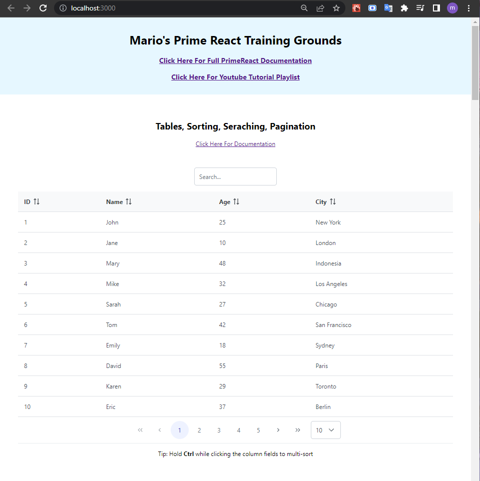
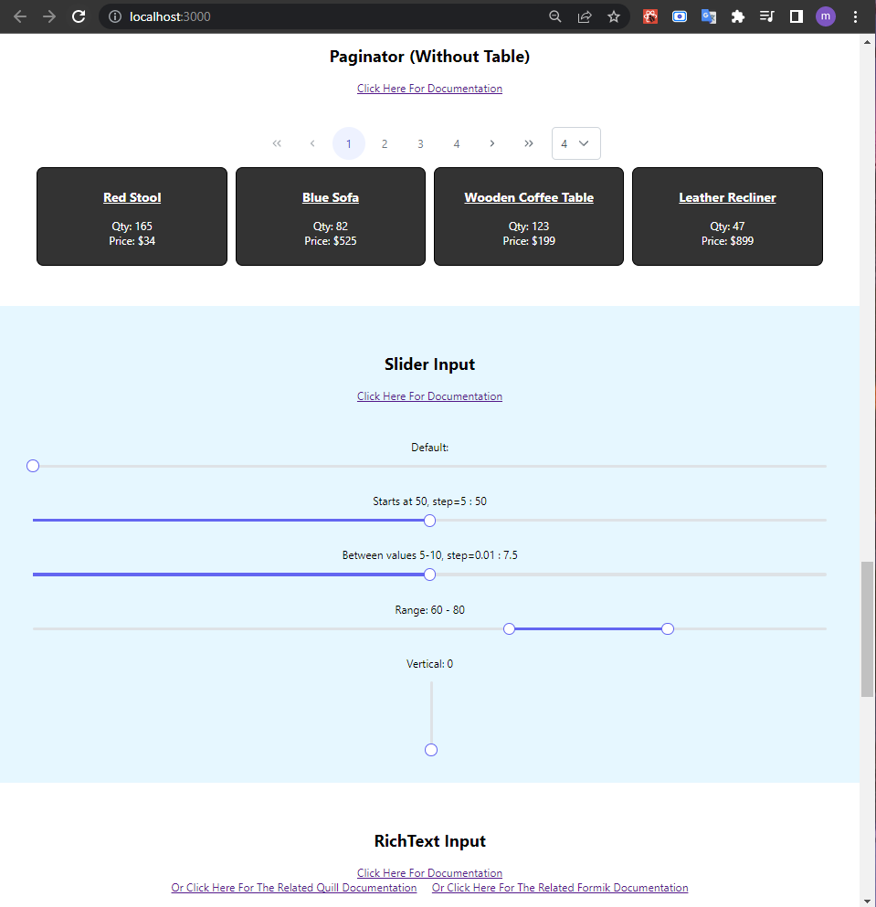

# Prime React Components Training

A playground where I test out and get the feel of Prime React Components and understand the ease of using them and modifying them.

Project made by Mario (with some of my own code modifications).

Project is hosted by Netlify. It can be viewed [here](https://mario-primereact-practice.netlify.app/)

---

Some screenshots:

---

The tutorial video can be found [here](https://www.youtube.com/playlist?list=PLg5sLLxn9GrJb4f78Kox2l__UfNP-7J7n).

